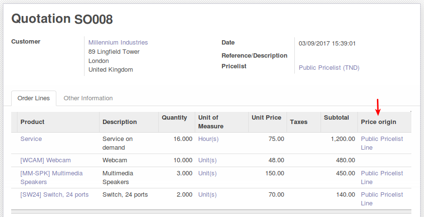
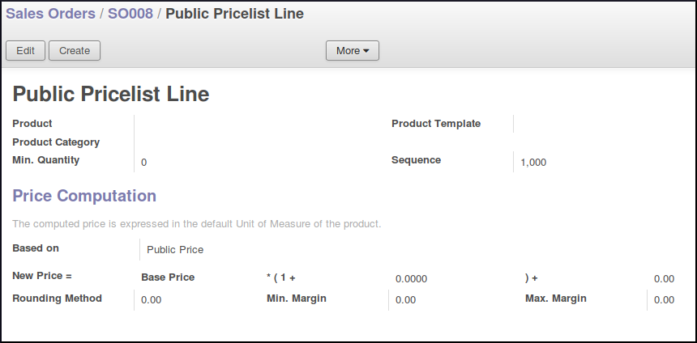

.. image:: https://img.shields.io/badge/licence-AGPL--3-blue.svg
   :target: http://www.gnu.org/licenses/agpl-3.0-standalone.html
   :alt: License: AGPL-3

=================
Sale Price Origin
=================

|

Display product pricelist items used to compute price on sale order line
(tree and form view).

|

.. image:: sale_price_origin/static/description/sale.png
   :alt: .

You know which rule has computed your unit price at glance.

Here 'Webcam' price has been modified manually:
price origin is no more displayed

|

Consider to install web_tree_many2one_clickable module
for a better usability: directly access to the price item

.. image:: sale_price_origin/static/description/item.png
   :alt: .

|

Contributors
------------

* David BEAL <david.beal@akretion.com>

.. image:: sale_price_origin/static/description/akretion.png
   :alt:

