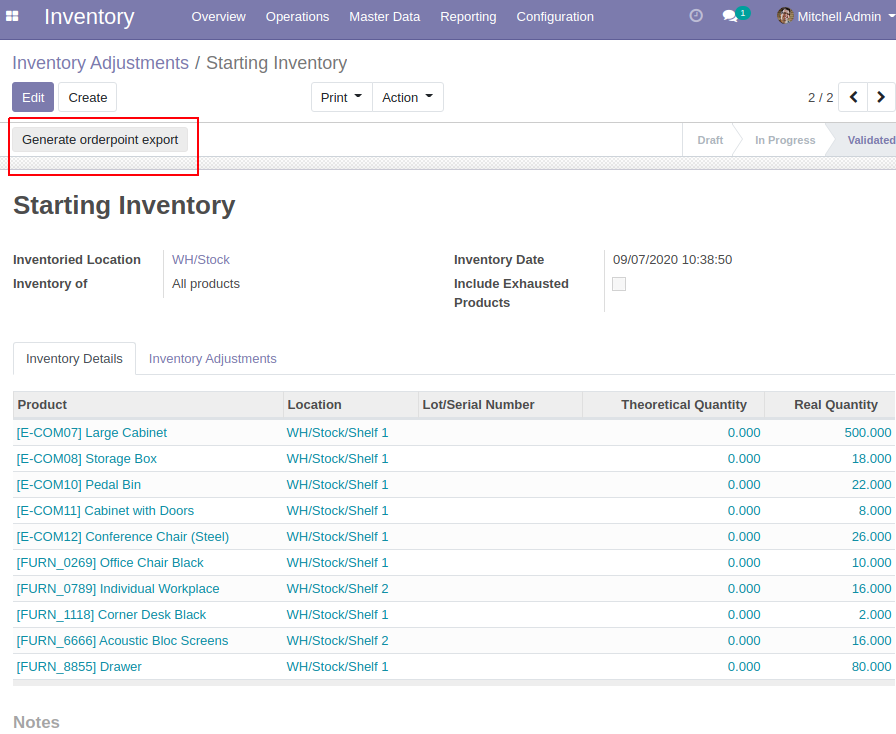
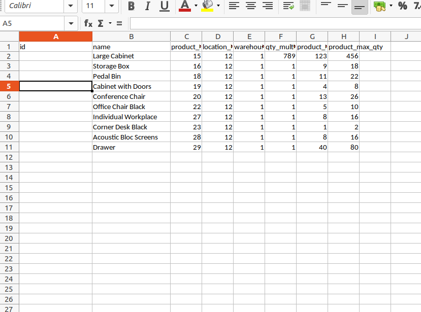
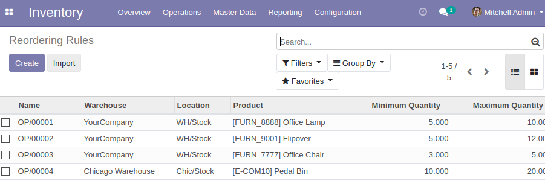

Click on the "Generate Reordering Rules export" to get an excel file.

Complete this excel file.

Go to Reordering Rules screen and do a simple Odoo standard import with that modified excel file.

